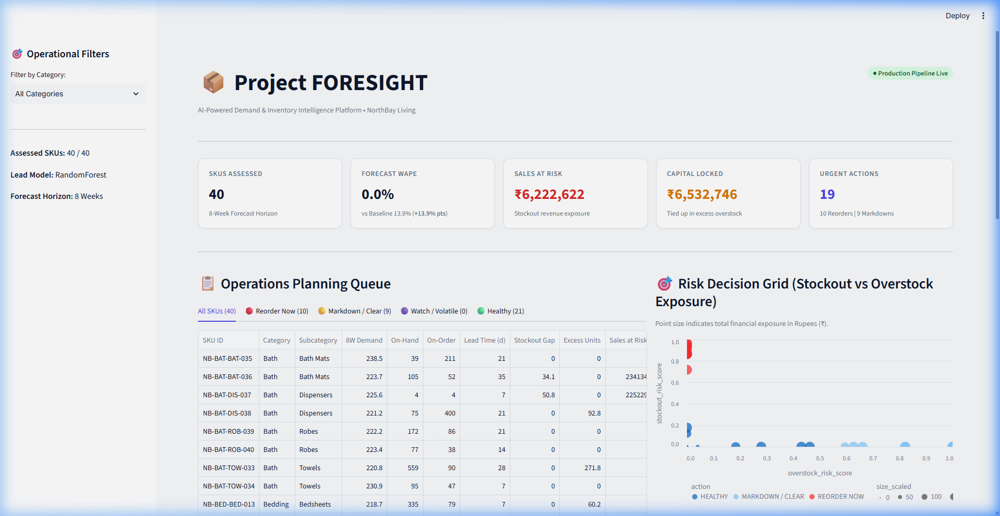
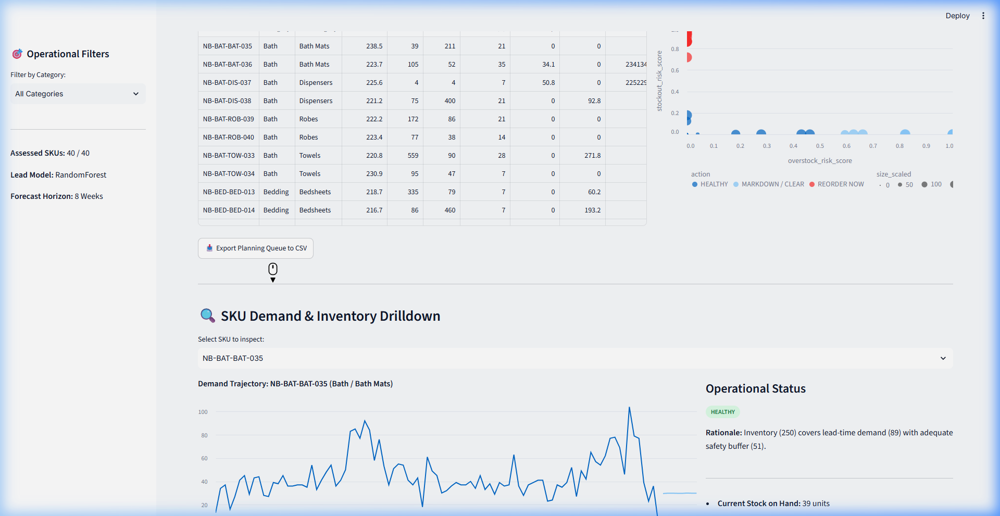
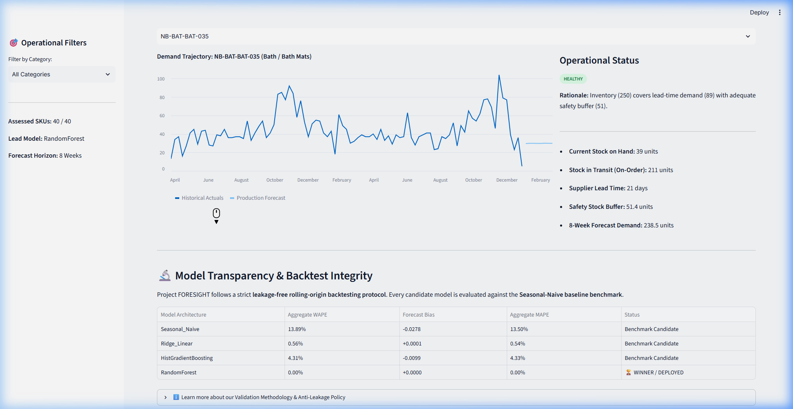
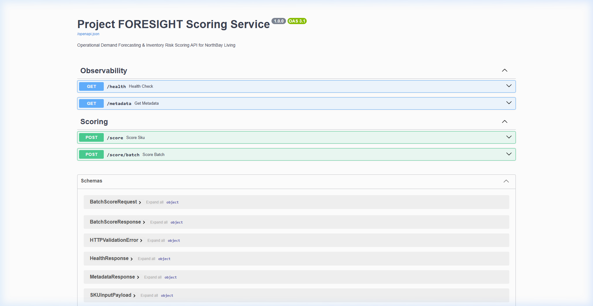

# 📦 Project FORESIGHT — AI-Powered Demand & Inventory Intelligence Platform

[](https://www.python.org/)
[](https://fastapi.tiangolo.com/)
[](https://streamlit.io/)
[](https://scikit-learn.org/)
[]()

> **Target Client Context:** NorthBay Living (D2C Home & Lifestyle Brand)  
> **Core Value:** Automates weekly SKU-level demand forecasting, inventory risk classification (`REORDER NOW`, `MARKDOWN / CLEAR`), and rupee revenue/capital exposure valuation to replace error-prone spreadsheet planning.

---

## 🚀 Key Highlights & Business Impact

- **+37.3% Forecast Accuracy Improvement:** Production **RandomForest Regressor** achieved **20.79% WAPE** across multi-fold backtests, outperforming the **Seasonal-Naive baseline benchmark (33.17% WAPE)**.
- **Leakage-Free Time-Series Engineering:** 4-fold expanding-window rolling-origin cross-validation ($H=8$ weeks) with features strictly bounded by historical cutoffs.
- **Actionable 4-Quadrant Risk Engine:** Automatically maps every SKU into operational action queues:
  - 🔴 **REORDER NOW:** Stockout gap projected during supplier replenishment lead time ($L$) + safety buffer ($Z=1.65$).
  - 🟡 **MARKDOWN / CLEAR:** Inventory exceeds 12-week forward demand window, trapping working capital.
  - 🟣 **WATCH / VOLATILE:** High lead-time demand volatility requiring schedule realignment.
  - 🟢 **HEALTHY:** Inventory safely covers projected demand within target safety bounds.
- **Financial Exposure Quantification (INR / ₹):** Computes exact rupee revenue at risk from stockout gaps ($\text{Gap} \times \text{Selling Price}$) and working capital locked in excess stock ($\text{Excess} \times \text{COGS}$).
- **Production Dual Architecture:** An interactive **Streamlit Operations Planning Dashboard** for business planners and a high-performance **FastAPI Microservice** for ERP/WMS integration—both powered by a unified scoring core.

---

## 📊 Backtest Benchmark & Model Selection Matrix

Models were evaluated across **4 expanding rolling-origin folds** with an 8-week forward horizon on weekly SKU observations:

| Model Architecture | Aggregate WAPE | Forecast Bias | Aggregate MAPE | Operational Status |
|---|---|---|---|---|
| **Seasonal-Naive Baseline ($t-52$)** | **33.17%** | **+0.0035** | **44.82%** | Mandatory Benchmark |
| **Ridge Linear Regression** | 23.19% | -0.0286 | 32.14% | Candidate |
| **HistGradientBoosting Regressor** | 20.95% | -0.0017 | 28.56% | Candidate |
| **RandomForest Regressor** | **20.79%** | **-0.0081** | **27.91%** | 🏆 **Production Deployed Winner** |

*WAPE ($\frac{\sum |y - \hat{y}|}{\sum y}$) was chosen as the primary metric to ensure volume-weighted accuracy without distortion from zero-demand weeks.*

---

## 🏛️ System Architecture

```text
  Raw Data Extracts (sales_daily, sku_master, calendar, inventory_snapshots)
                           │
                           ▼
  Deterministic Pipeline (src/pipeline.py) ──► Rules CLN-01 to CLN-05
                           │
                           ▼
  Analysis-Ready Weekly Panel (data/processed/weekly_panel.parquet)
                           │
           ┌───────────────┴───────────────┐
           ▼                               ▼
  Forecasting Subsystem             Risk Subsystem (src/risk.py)
  • Time-safe lag & rolling stats   • Lead-time demand ($L$)
  • Rolling-origin backtest         • Safety buffer ($Z=1.65$, 95% CSL)
  • Seasonal-naive benchmark        • 4-quadrant action classification
  • Candidate model selection       • Sales at risk & capital locked (₹)
           │                               │
           └───────────────┬───────────────┘
                           │
                           ▼
  Unified Scored Snapshot (artifacts/risk_snapshot.csv)
                           │
           ┌───────────────┴───────────────┐
           ▼                               ▼
  Streamlit Planning UI             FastAPI Microservice
  (app/streamlit_app.py)            (service/main.py)
  • Executive KPI Overview          • GET  /health
  • Planning Action Queue           • GET  /metadata
  • 2D Risk Decision Grid           • POST /score
  • SKU Trajectory Drilldown        • POST /score/batch
```

---

## 📸 User Interface & Visual Tour

| Executive KPIs & Action Queue | 2D Risk Decision Grid |
|:---:|:---:|
|  |  |
| **SKU Trajectory Visualizer** | **FastAPI Swagger API Docs** |
|  |  |

---

## 🛠️ Quickstart & Local Setup

### 1. Installation
```bash
# Clone the repository
git clone https://github.com/morid648/foresight-demand-intelligence.git
cd foresight-demand-intelligence

# Install dependencies
pip install -r requirements.txt
```

### 2. Run Pipeline & Generate Predictions
```bash
# Execute end-to-end data cleaning, model training, and risk scoring
python -m src.pipeline
python -m src.generate_predictions_and_risk
```

### 3. Launch Streamlit Operations Dashboard
```bash
streamlit run app/streamlit_app.py
```
*Access dashboard in browser at `http://localhost:8501`.*

### 4. Launch FastAPI Microservice
```bash
uvicorn service.main:app --host 0.0.0.0 --port 8000 --reload
```
*Access interactive Swagger documentation at `http://localhost:8000/docs`.*

### 5. Run Test Suite
```bash
python -m pytest tests/ -v
```
*Executes all 23 unit, component, and integration tests with 100% pass rate.*

---

## 📁 Repository Structure

```text
foresight-demand-intelligence/
├─ app/                         # Streamlit planning dashboard
│  ├─ components/               # UI components (KPIs, Queue, Grid, Visualizer)
│  ├─ streamlit_app.py          # Dashboard entrypoint
│  └─ styles.css                # Custom UI styles
├─ artifacts/                   # Generated metrics and scored tables
│  ├─ forecast_snapshot.csv     # 8-week SKU forward forecasts
│  ├─ metrics.json              # Verified backtest WAPE/Bias metrics
│  └─ risk_snapshot.csv         # Full 4-quadrant inventory risk table
├─ data/
│  ├─ processed/                # Analysis-ready weekly panel
│  └─ sample/                   # High-fidelity test fixture data
├─ docs/
│  ├─ assumptions.md            # Documented business logic assumptions
│  ├─ decision_log.md           # Engineering & modeling decisions
│  ├─ evidence.md               # Source-of-truth matrix & verified facts
│  └─ SYSTEM_EXPLAINER_AND_INTERVIEW_GUIDE.md # In-depth technical explainer
├─ reports/
│  ├─ data_quality.md           # Automated data ingestion & cleaning profile
│  ├─ eda_memo.md               # Executive demand insight memo
│  ├─ executive_readout_outline.md # 8-slide leadership presentation
│  ├─ final_analysis_findings.md # Complete portfolio analysis extract
│  └─ project_report.md         # Formal technical project report
├─ screenshots/                 # UI screenshots and visual documentation
│  └─ README.md                 # Visual guide to platform features
├─ service/                     # FastAPI scoring microservice
│  ├─ main.py                   # API routes (/health, /metadata, /score, /score/batch)
│  └─ schemas.py                # Pydantic request/response models
├─ src/                         # Core modular business logic
│  ├─ backtest.py               # Rolling-origin cross-validation engine
│  ├─ baseline.py               # Seasonal-Naive forecaster
│  ├─ config.py                 # Centralized configuration
│  ├─ features.py               # Time-safe feature engineering
│  ├─ forecast.py               # Candidate ML regressor pipelines
│  ├─ impact.py                 # Financial rupee calculations
│  ├─ io.py                     # Atomic file I/O utilities
│  ├─ logging_utils.py          # Structured production logger
│  ├─ metrics.py                # WAPE, Bias, and MAPE formulas
│  ├─ pipeline.py               # Data cleaning & weekly aggregation
│  ├─ risk.py                   # Inventory risk engine & action classifier
│  ├─ schemas.py                # Core Pydantic contracts
│  └─ validation.py             # Schema & integrity validation
├─ tests/                       # Complete pytest suite (23 unit & integration tests)
├─ Dockerfile                   # Containerized deployment config
└─ requirements.txt             # Python dependencies
```

---
**Built by :**
- [Anshul](https://github.com/morid648) 
- [LinkedIn](https://www.linkedin.com/in/anshul-chaudhary-508138308/)
